# 🏗️ MARTE — სრული არქიტექტურის აუდიტი

> **პროექტი:** MARTE (Multi-tenant ERP/POS)
> **თარიღი:** 2026-03-15
> **აუდიტორი:** Senior Architect AI

---

## 📊 პროექტის მიმოხილვა

| კატეგორია | რაოდენობა |
|---|---|
| **DB ცხრილები (public schema)** | 55+ |
| **SQL მიგრაციები** | 37 ფაილი |
| **Pages (გვერდები)** | 61 კომპონენტი |
| **Components** | 82 კომპონენტი (22 custom + 34 UI + 7 POS + 3 Salon + 3 Clinic...) |
| **Zustand Stores** | 6 store |
| **Views** | 3 (customer_ltv, product_abc_analysis, basket_analysis) |
| **DB Functions** | 10+ (process_sale, process_receiving, process_transfer...) |

---

## 🔴 კრიტიკული უსაფრთხოების პრობლემები (ERROR)

> [!CAUTION]
> ეს პრობლემები **დაუყოვნებლივ** უნდა მოგვარდეს — წარმოადგენს სერიოზულ უსაფრთხოების რისკს.

### 1. RLS გამორთულია — `landed_cost_allocations`
ცხრილი `landed_cost_allocations` არის **public**, მაგრამ **RLS** ჩართული არ არის. ნებისმიერ ავტორიზებულ მომხარებელს შეუძლია ყველა ჩანაწერის ნახვა/ცვლილება.

**გამოსწორება:**
```sql
ALTER TABLE public.landed_cost_allocations ENABLE ROW LEVEL SECURITY;
-- შექმენით შესაბამისი tenant-based პოლიტიკა
```

### 2. Security Definer Views (3 ცალი)
შემდეგი View-ები `SECURITY DEFINER`-ით არის განსაზღვრული — RLS პოლიტიკა **შემქმნელის** უფლებებით სრულდება, და არა მომხმარებლის:

| View | რისკი |
|---|---|
| `customer_ltv` | მომხმარებელს შეუძლია სხვა ტენანტის მონაცემების ნახვა |
| `product_abc_analysis` | იგივე |
| `basket_analysis` | იგივე |

**გამოსწორება:** View-ები `SECURITY INVOKER`-ით უნდა შეიქმნას (ან `WHERE tenant_id = ...` ფილტრი დაემატოს).

### 3. Leaked Password Protection გამორთულია
Supabase Auth-ში **Leaked Password Protection** გამორთულია — HaveIBeenPwned-ით კომპრომეტირებული პაროლების შემოწმება არ ხდება.

📎 [ჩართვის ინსტრუქცია](https://supabase.com/docs/guides/auth/password-security#password-strength-and-leaked-password-protection)

---

## 🟡 უსაფრთხოების გაფრთხილებები (WARNING)

### 4. RLS Policy Always True — 9 ცხრილი
შემდეგ ცხრილებს აქვთ `USING (true)` / `WITH CHECK (true)` პოლიტიკა, რაც RLS-ს ფაქტიურად გამორთულად ტოვებს:

| ცხრილი | პოლიტიკის სახელი |
|---|---|
| `accounting_rules` | Users can manage accounting rules |
| `budget_lines` | Users can manage budget lines |
| `budgets` | Users can manage budgets |
| `client_points_history` | Allow authenticated access |
| `exchange_rates` | Public read, auth logic |
| `fixed_assets` | Users can manage fixed assets |
| `landed_cost_items` | Users can manage landed cost items |
| `promotions` | Allow authenticated access |
| `stock_batches` | Users can manage stock batches |

**გამოსწორება:** ყველა პოლიტიკას tenant_id ფილტრი დაემატოს:
```sql
-- მაგალითი:
USING (tenant_id IN (
  SELECT tenant_id FROM tenant_members WHERE user_id = (select auth.uid())
))
```

### 5. Function Search Path Mutable — 10 ფუნქცია
ფუნქციებს `search_path` პარამეტრი არ აქვთ დაყენებული, რაც SQL injection-ის რისკს ქმნის:

| ფუნქცია |
|---|
| `deduct_salon_materials` |
| `calculate_salon_commission` |
| `process_receiving` |
| `process_sale` |
| `apply_accounting_rules` |
| `auto_match_bank_lines` |
| `apply_landed_cost` |
| `process_transfer` |
| `update_customer_segments` |
| `on_client_loyalty_change` |

**გამოსწორება:**
```sql
ALTER FUNCTION public.process_sale(...) SET search_path = public;
```

---

## ⚡ შესრულების (Performance) პრობლემები

### 6. Unindexed Foreign Keys — 90+ ცალი

> [!WARNING]
> 90-ზე მეტი Foreign Key-ს არ აქვს ინდექსი — JOIN და CASCADE ოპერაციები ნელი იქნება.

**ყველაზე კრიტიკული (ხშირად გამოყენებული ცხრილები):**

| ცხრილი | FK სვეტი |
|---|---|
| `transactions` | `tenant_id`, `user_id` |
| `transaction_items` | `transaction_id` |
| `products` | `tenant_id`, `user_id` |
| `clients` | `tenant_id`, `user_id` |
| `categories` | `tenant_id`, `user_id` |
| `invoices` | `tenant_id`, `transaction_id` |
| `salon_appointments` | `tenant_id`, `client_id`, `specialist_id`, `user_id` |
| `clinic_appointments` | `tenant_id`, `doctor_id`, `patient_id` |
| `shifts` | `tenant_id`, `user_id`, `cashier_id` |
| `employees` | `tenant_id` |
| `expenses` | `tenant_id`, `user_id` |
| `transfers` | `tenant_id`, `product_id`, `from_warehouse_id`, `to_warehouse_id` |

**გამოსწორება მიგრაციით:**
```sql
-- პრიორიტეტული ინდექსები (ყველაზე ხშირად გამოიყენება):
CREATE INDEX CONCURRENTLY idx_transactions_tenant ON transactions(tenant_id);
CREATE INDEX CONCURRENTLY idx_transactions_user ON transactions(user_id);
CREATE INDEX CONCURRENTLY idx_transaction_items_tx ON transaction_items(transaction_id);
CREATE INDEX CONCURRENTLY idx_products_tenant ON products(tenant_id);
CREATE INDEX CONCURRENTLY idx_clients_tenant ON clients(tenant_id);
-- ... ყველა tenant_id FK-ისთვის
```

### 7. Auth RLS InitPlan — 40+ RLS პოლიტიკა
RLS პოლიტიკებში `auth.uid()` ყოველ ჩანაწერზე თავიდან გამოითვლება. ეს **მნიშვნელოვნად** ანელებს query-ებს.

**დაზიანებული ცხრილები (ნაწილობრივი სია):**

| ცხრილი | პოლიტიკა |
|---|---|
| `profiles` | Users can view own profile, Users can update own profile, Admins can view all profiles |
| `transaction_items` | crud_transaction_items |
| `shift_sales` | Users manage shift sales via shift |
| `shift_sale_items` | Users manage shift sale items via shift |
| `journal_lines` | Users manage journal_lines via entry |
| `bundle_items` | Users manage bundle_items via bundle |
| `inventory_count_items` | Users manage items via inventory_counts |
| `bank_statement_lines` | Users access lines via uploads |
| `recipe_ingredients` | Users manage recipe_ingredients via recipe |
| `products`, `categories`, `subcategories`, `warehouses`, `write_offs`, `suppliers`, `transactions`, `expenses`, `transfers`, `auto_order_rules`, `invoices`, `currencies`, `shifts`, `employees`, `auto_order_history`, `recipes`, `inventory_counts`, `ingredients`, `queue_tickets`, `user_roles`, ...etc | crud_multi_tenant |
| `clinic_*` (5 ცხრილი) | crud_multi_tenant_clinic_* |
| `salon_*` (5 ცხრილი) | crud_multi_tenant |
| `global_announcements` | Superadmins can manage announcements |
| `audit_logs` | Superadmins can view/insert audit logs |
| `tenants` | tenants_select, tenants_update |
| `tenant_members` | tenant_members_select |

**გამოსწორება — ყველა `auth.uid()` → [(select auth.uid())](file:///c:/Users/jabam/OneDrive/Desktop/MARTE/src/App.tsx#136-228):**
```sql
-- მაგალითი: ნაცვლად
USING (user_id = auth.uid())
-- გამოიყენეთ:
USING (user_id = (select auth.uid()))
```

### 8. გამოუყენებელი ინდექსები — 10 ცალი

| ინდექსი | ცხრილი |
|---|---|
| `idx_activity_logs_entity` | activity_logs |
| `idx_audit_log_table` | audit_log |
| `idx_audit_log_record` | audit_log |
| `idx_stock_batches_status` | stock_batches |
| `idx_budgets_dates` | budgets |
| `idx_accounting_rules_lookup` | accounting_rules |
| `idx_bank_lines_match` | bank_statement_lines |
| `idx_bank_lines_date` | bank_statement_lines |
| `idx_ingredients_user` | ingredients |
| `idx_prod_orders_status` | production_orders |

> [!NOTE]
> ეს ინდექსები შესაძლოა ჯერ არ გამოყენებულა რადგან ფუნქციონალი ახალია. **მონიტორინგი** საჭიროა წაშლამდე.

---

## 🏛️ არქიტექტურის შეფასება

### ✅ ძლიერი მხარეები

| სფერო | შეფასება |
|---|---|
| **Multi-Tenancy** | ყველა ძირითად ცხრილს აქვს `tenant_id` — კარგი იზოლაცია |
| **მოდულარობა** | გვერდები ლოგიკურად არის დაყოფილი ინდუსტრიების მიხედვით (POS, Salon, Clinic) |
| **UI Component Library** | shadcn/ui ბიბლიოთეკა თანმიმდევრულად გამოიყენება (34+ UI კომპონენტი) |
| **State Management** | Zustand stores — მინიმალური, ფოკუსირებული |
| **Feature Flags** | Superadmin-ის დონეზე feature flags მხარდაჭერა |
| **Audit Trail** | აქტივობის ლოგირება და audit_log/audit_logs ცხრილები |

### ⚠️ გამოსასწორებელი

| სფერო | პრობლემა | პრიორიტეტი |
|---|---|---|
| **RLS Consistency** | 9 ცხრილს აქვს `USING(true)` — ტენანტ იზოლაცია არ მუშაობს | 🔴 მაღალი |
| **Duplicate Tables** | `audit_log` და `audit_logs` — ორი მსგავსი ცხრილი | 🟡 საშუალო |
| **DB Functions** | search_path არ არის დაყენებული 10 ფუნქციაზე | 🔴 მაღალი |
| **View Security** | 3 View `SECURITY DEFINER`-ით — ტენანტ leak-ის რისკი | 🔴 მაღალი |
| **Index Gaps** | 90+ FK ინდექსი აკლია | 🟡 საშუალო |
| **RLS Performance** | `auth.uid()` 40+ პოლიტიკაში `select`-ში არ არის wrapped | 🟡 საშუალო |

---

## 📁 Frontend არქიტექტურის ანალიზი

### გვერდების კლასიფიკაცია (61 გვერდი)

| მოდული | გვერდები |
|---|---|
| **Core POS** | POSPage, ProductsPage, CategoriesPage, BundlesPage, PricingPage, PriceRulesPage |
| **საწყობი** | ReceivingPage, InventoryCountPage, InventoryMethodsPage, DistributionPage, LandedCostPage |
| **ფინანსები** | AccountingPage, AccountingRulesPage, CashFlowPage, ExpensesPage, InvoicesPage, BankIntegrationPage, ReconciliationPage, CurrencyPage, FiscalReportPage, FixedAssetsPage |
| **HR** | EmployeesPage, SalaryPage, AttendancePage |
| **CRM** | CRMPage, ClientsPage |
| **სალონი** | SalonPage, SalonAnalyticsPage, SalonAppointmentsPage, SalonServicesPage |
| **კლინიკა** | ClinicPage |
| **ანალიტიკა** | DashboardPage, ReportsPage, CashierStatsPage, ActivityLogPage |
| **ადმინი** | SuperAdminPage, AdminPanelPage, BranchesPage, SettingsPage |
| **სხვა** | AuthPage, ProfilePage, OrdersPage, QueuePage, ReturnsPage, DataExportPage, GuidePage, etc. |

### კომპონენტების სტრუქტურა (82 ფაილი)

```
src/components/
├── 22 გლობალური კომპონენტი (AppLayout, AppSidebar, CommandPalette, etc.)
├── pos/ — 7 POS-სპეციფიკური (POSCart, POSPaymentDialog, etc.)
├── salon/ — 2 (AppointmentModal, BookingCalendar)
├── clinic/ — 3 (ClinicAppointmentModal, ClinicCalendar, TreatmentPlanner)
└── ui/ — 48 shadcn/ui კომპონენტი
```

### State Management (6 Stores)

| Store | ზომა | დანიშნულება |
|---|---|---|
| [useAuthStore.ts](file:///C:/Users/jabam/OneDrive/Desktop/MARTE/src/stores/useAuthStore.ts) | 6.3 KB | ავტორიზაცია, ტენანტი, პროფილი |
| [usePricingStore.ts](file:///C:/Users/jabam/OneDrive/Desktop/MARTE/src/stores/usePricingStore.ts) | 4.2 KB | ფასების წესები |
| [useSupplierPaymentStore.ts](file:///C:/Users/jabam/OneDrive/Desktop/MARTE/src/stores/useSupplierPaymentStore.ts) | 3.8 KB | მომწოდებლის გადახდები |
| [useOrderStore.ts](file:///C:/Users/jabam/OneDrive/Desktop/MARTE/src/stores/useOrderStore.ts) | 2.9 KB | შეკვეთები |
| [useReceiptStore.ts](file:///C:/Users/jabam/OneDrive/Desktop/MARTE/src/stores/useReceiptStore.ts) | 2.1 KB | ქვითარი |
| [useNotificationStore.ts](file:///C:/Users/jabam/OneDrive/Desktop/MARTE/src/stores/useNotificationStore.ts) | 1.4 KB | შეტყობინებები |

---

## 📋 SQL მიგრაციების რუკა (37 ფაილი)

```mermaid
graph TD
    A[create_tables.sql] --> B[create_multi_tenant_migration.sql]
    B --> C[create_registration_trigger.sql]
    B --> D[create_user_roles.sql]
    D --> E[expand_user_roles.sql]
    B --> F[process_sale.sql]
    B --> G[process_receiving.sql]
    B --> H[process_transfer.sql]
    B --> I[create_warehouse_enhancements.sql]
    B --> J[create_invoices_table.sql]
    B --> K[create_analytics_views.sql]
    B --> L[create_audit_trail.sql]
    B --> M[create_activity_logs.sql]
    B --> N[create_accounting_tables.sql]
    N --> O[create_accounting_enhancements.sql]
    N --> P[create_accounting_rules.sql]
    N --> Q[create_reconciliation.sql]
    B --> R[create_pos_enhancements.sql]
    B --> S[create_hr_payroll_tables.sql]
    B --> T[create_crm_loyalty_tables.sql]
    T --> U[update_loyalty_segments.sql]
    B --> V[create_salon_tables.sql]
    V --> W[create_salon_services_bom.sql]
    V --> X[create_salon_commissions.sql]
    V --> Y[create_specialist_shifts.sql]
    V --> Z[create_salon_stock_trigger.sql]
    B --> AA[create_clinic_tables.sql]
    B --> AB[create_production_tables.sql]
    AB --> AC[migration_production_payroll.sql]
    B --> AD[create_landed_costs.sql]
    B --> AE[admin_panel_policies.sql]
    AE --> AF[add_feature_flags.sql]
    AE --> AG[add_global_announcements.sql]
    AE --> AH[add_usage_limits.sql]
    B --> AI[migrate_stores_to_db.sql]
    AI --> AJ[migrate_remaining_stores.sql]
    B --> AK[update_tenants_subscription.sql]
```



---

## 🎯 რეკომენდებული სამოქმედო გეგმა

### ფაზა 1 — კრიტიკული უსაფრთხოება (პრიორიტეტი: 🔴)
1. **RLS ჩართვა** `landed_cost_allocations`-ზე
2. **View-ების გადაკეთება** SECURITY INVOKER-ით + tenant ფილტრი
3. **9 ცხრილის RLS პოლიტიკა** — `USING(true)` → tenant-based
4. **10 ფუნქციის search_path** — `SET search_path = public`
5. **Leaked Password Protection** ჩართვა Supabase Dashboard-იდან

### ფაზა 2 — Performance ოპტიმიზაცია (პრიორიტეტი: 🟡)
6. **ინდექსების შექმნა** — პრიორიტეტულად `tenant_id`, `user_id` და ხშირ JOIN FK-ებზე
7. **RLS InitPlan fix** — `auth.uid()` → [(select auth.uid())](file:///c:/Users/jabam/OneDrive/Desktop/MARTE/src/App.tsx#136-228) ყველა პოლიტიკაში
8. **გამოუყენებელი ინდექსების** მონიტორინგი და შესაძლო წაშლა

### ფაზა 3 — არქიტექტურის გაწმენდა (პრიორიტეტი: 🟢)
9. **`audit_log` vs `audit_logs`** — ერთის კონსოლიდაცია
10. **SQL ფაილების ორგანიზება** — საქაღალდეებად (core/, modules/, admin/)

---

## 📈 საერთო ჯანმრთელობის ქულა

| კატეგორია | ქულა | კომენტარი |
|---|---|---|
| **არქიტექტურა** | ⭐⭐⭐⭐ (4/5) | მოდულური, multi-tenant, კარგად ორგანიზებული |
| **უსაფრთხოება** | ⭐⭐⭐ (3/5) | RLS ხარვეზები, SECURITY DEFINER views |
| **Performance** | ⭐⭐⭐ (3/5) | მრავალი ინდექსი აკლია, RLS initplan issues |
| **კოდის ხარისხი** | ⭐⭐⭐⭐ (4/5) | თანმიმდევრული, TypeScript, კარგი component patterns |
| **Scalability** | ⭐⭐⭐⭐ (4/5) | Multi-tenant ready, მაგრამ ინდექსები საჭიროა |

> **საერთო ქულა: 3.6/5** — კარგი ბაზა, მაგრამ უსაფრთხოების და performance-ის გაუმჯობესება აუცილებელია პროდაქშენამდე.
